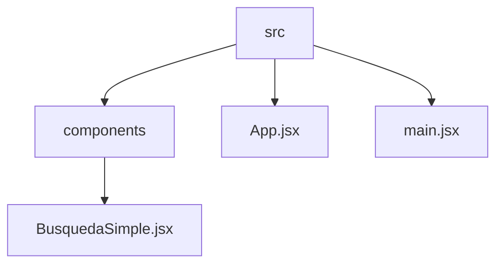

# TVMaze Search App
## 🗂️  Description

The TVMaze Search App is a simple web application that allows users to search for TV shows, view search results, and save favorite shows. The app uses the TV Maze API to fetch data and provides a user-friendly interface to interact with the data. This project is for developers who want to build a simple TV show search application using React, Vite, and Tailwind CSS.

The app provides a basic search functionality, allowing users to input a search query and view a list of matching TV shows. The app also allows users to save favorite shows and view them in a separate section.

## ✨ Key Features

* **Search Functionality**: Users can input a search query and view a list of matching TV shows.
* **Favorite Shows**: Users can save favorite shows and view them in a separate section.
* **TV Maze API Integration**: The app uses the TV Maze API to fetch data.
* **React, Vite, and Tailwind CSS**: The app is built using React, Vite, and Tailwind CSS.

## 🗂️ Folder Structure

## 🛠️ Tech Stack

## ⚙️ Setup Instructions

To run the project locally, follow these steps:

* Git clone the repository: `https://github.com/puntusovdima/TVMaze-Search.git`
* Install dependencies: `npm install`
* Start the development server: `npm run dev`

## 📁 Configuration Files

The project uses several configuration files:

* `tailwind.config.js`: Configures Tailwind CSS.
* `vite.config.js`: Configures Vite.
* `.gitignore`: Specifies files and directories to ignore in Git.
* `eslint.config.js`: Configures ESLint.

## 📦 Dependencies

The project depends on the following packages:

* `react`
* `react-dom`
* `vite`
* `tailwindcss`
* `eslint`

## 🤔 Troubleshooting

If you encounter issues while running the project, check the console for error messages. You can also try running `npm run lint` to check for linting errors.

 
 

  <a href="https://gitfull.vercel.app">Made by GitFull</a>

    
